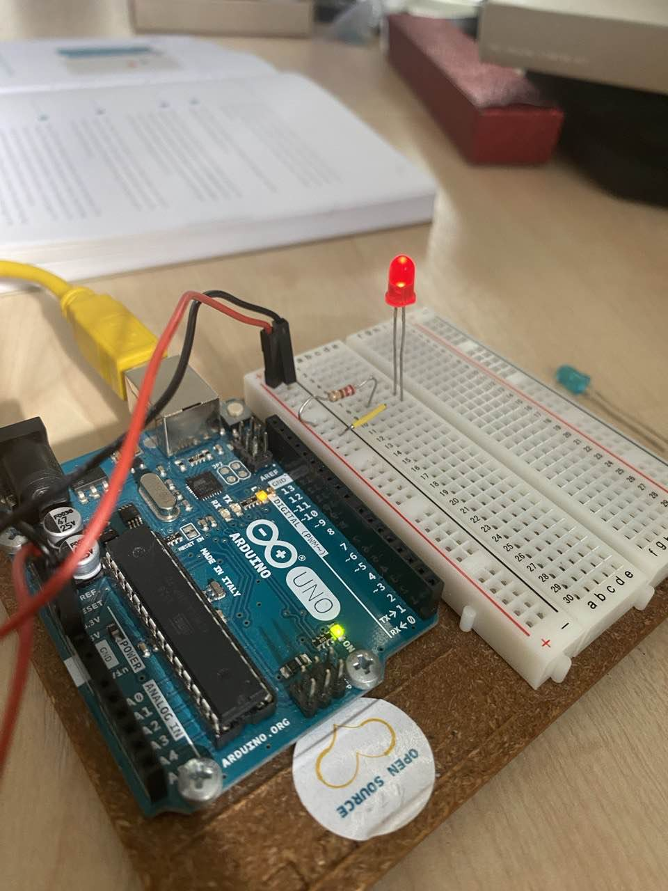
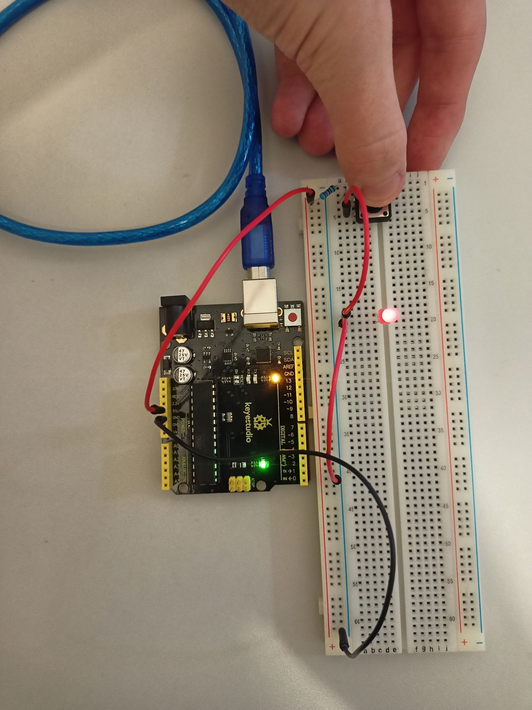
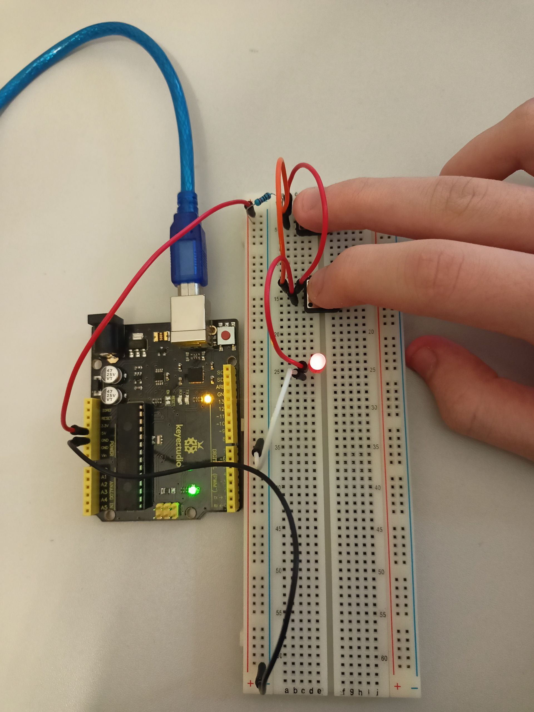
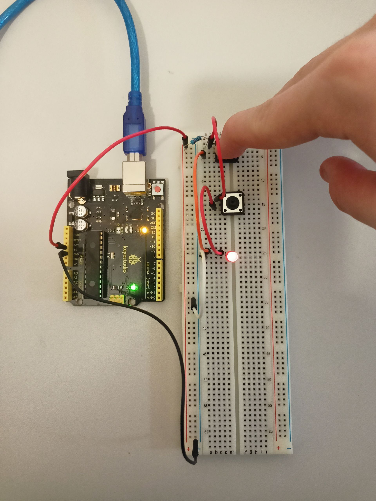

# GET TO KNOW YOUR TOOLS

Projekts "GET TO KNOW YOUR TOOLS" tika veidots, lai palīdzētu iepazīties ar pamata komponentēm un instrumentiem, kas tiek izmantoti Arduino programmēšanā. Projekta mērķis ir iepazīties ar būtiskākajām komponentēm, kuras izmanto Arduino projektos un gūt praktisku pieredzi, uzbūvējot vienkāršu shēmu uz breadboarda.

## Projektam ir nepieciešami:

- LED lampiņa (1x)
- Savienošanas vads (x4)
- Poga (2x)
- Rezistors (1x)

1: Šajā bildē mēs savienojām komponentus tā, lai spīdētu viena lampiņa. 

2: Šajā bildē mēs savienojām komponentus tā, ka, nospiežot pogu, spīd viena lampiņa, līdzīgi "IF" operatoram.

3: Šajā bildē mēs savienojām komponentus tā, lai lampiņa spīdētu tikai tad, kad ir nospiestas abas pogas, līdzīgi "AND" operatoram.

4: Šajā bildē mēs savienojām komponentus tā, lai lampiņa spīdētu, ja vismaz viena no pogām ir nospiesta, līdzīgi "OR" operatoram.

